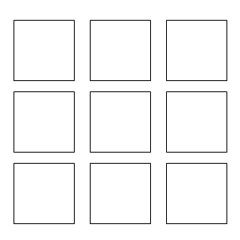

# cv-notes

computer vision code snippets.

## Contents

- CV00 CNN, Classification
- CV01 Transfer Learning, Classification
- CV02 Segmentation
- CV03 YOLO
  - CV03-1 Try YOLO
  - CV03-2 YOLO in tensorflow
  - CV03-3 Traffic Sign with YOLO
  - CV03-O Detecting in video
- CV04 GAN
  - CV04-1 GAN
  - CV04-2 DCGAN alike
- CV05 Neural Style Transfer
- CV06 GAN, more
  - CV06-1 CycleGAN
  - CV06-2 SRGAN*
- CV07 Hyperparameter Tuning*
- CV08 Object Detection, more
  - CV08-1 R-CNN*
  - CV08-2 SSD*
- CV09 Final Project: Deep Fake*

## Preview

